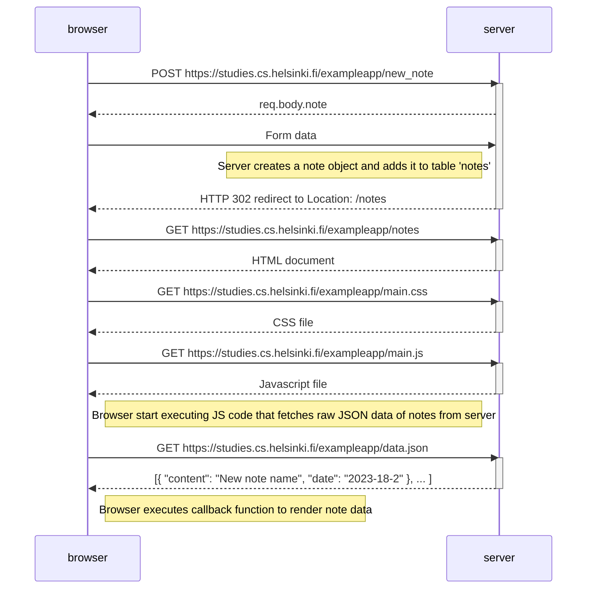

```mermaid
sequenceDiagram
  participant browser
  participant server
  
  browser->>server: POST https://studies.cs.helsinki.fi/exampleapp/new_note
  activate server
  server-->>browser: req.body.note
  browser->>server: Form data
  Note left of server: Server creates a note object and adds it to table 'notes'
  server-->>browser: HTTP 302 redirect to Location: /notes
  deactivate server
  
  browser->>server: GET https://studies.cs.helsinki.fi/exampleapp/notes
  activate server
  server-->>browser: HTML document
  deactivate server
  
  browser->>server: GET https://studies.cs.helsinki.fi/exampleapp/main.css
  activate server
  server-->>browser: CSS file
  deactivate server
  
  browser->>server: GET https://studies.cs.helsinki.fi/exampleapp/main.js
  activate server
  server-->>browser: Javascript file
  deactivate server
  
  Note right of browser: Browser start executing JS code that fetches raw JSON data of notes from server
  
  browser->>server: GET https://studies.cs.helsinki.fi/exampleapp/data.json
  activate server
  server-->>browser: [{ "content": "New note name", "date": "2023-18-2" }, ... ]
  deactivate server
  
  Note right of browser: Browser executes callback function to render note data
  
```
