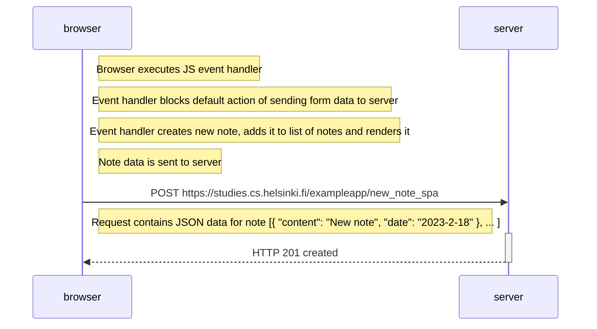

```mermaid
sequenceDiagram
  participant browser
  participant server
  
  Note right of browser: Browser executes JS event handler
  Note right of browser: Event handler blocks default action of sending form data to server
  Note right of browser: Event handler creates new note, adds it to list of notes and renders it
  
  Note right of browser: Note data is sent to server
  browser->>server: POST https://studies.cs.helsinki.fi/exampleapp/new_note_spa
  Note right of browser: Request contains JSON data for note [{ "content": "New note", "date": "2023-2-18" }, ... ]
  activate server
  server-->>browser: HTTP 201 created
  deactivate server
```
